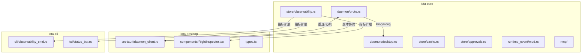

# 技术设计 — code-quality-plan 执行阶段

> 本设计基于 [requirements.md](./requirements.md)（FR-001 ~ FR-012, NFR-001/002/003）。
> 目标：对 `crates/` 下源码实施全部重构、优化、清理变更。
> 执行模型：**Claude Opus 4.6**（`global.anthropic.claude-opus-4-6-v1`）

---

## 1. 需求追溯

| 需求 | 设计方案章节 |
|------|-------------|
| FR-001 Daemon 协议版本协商抽象 (R-02) | §3.1 |
| FR-002 Desktop Daemon 断线重连与心跳 (R-01) | §3.2 |
| FR-003 三端 Token 展示数据源统一 (R-05) | §3.3 |
| FR-004 Cache 层 Legacy 迁移代码移除 (R-03) | §3.4 |
| FR-005 Token Usage 延迟/吞吐指标暴露 (O-01) | §3.5 |
| FR-006 Daemon 流式吞吐压测基准 (O-02) | §3.6 |
| FR-007 三端 Observability 输出对齐 (O-03) | §3.7 |
| FR-008 单元测试覆盖缺口扫描与补齐 (O-04) | §3.8 |
| FR-009 集成/验收测试补齐 (O-05) | §3.9 |
| FR-010 MCP 跨语言 SDK 漂移检测 (O-06) | §3.10 |
| FR-011 Cache Legacy 迁移代码人工复核 (C-02) | §3.11 |
| FR-012 Approvals Fallback 注释优化 + Desktop 文件审查 (C-03/C-04) | §3.12 |
| NFR-001 编译兼容性 | §4 |
| NFR-002 增量可交付 | §4 |
| NFR-003 性能无退化 | §4 |

---

## 2. 架构概览

### 2.1 变更范围



### 2.2 依赖执行顺序

```
Phase A (基础): FR-001 → FR-011 → FR-004
Phase B (核心): FR-002, FR-003 (依赖 FR-001)
Phase C (指标): FR-005, FR-006 (依赖 FR-002/FR-003)
Phase D (对齐): FR-007 (依赖 FR-003)
Phase E (独立): FR-008, FR-009, FR-010, FR-012 (并行)
```

### 2.3 设计原则

- **向后兼容**：`DESKTOP_PROTOCOL_VERSION = 2` 客户端连接新 server 正常工作
- **编译期安全**：tagged enum + exhaustive match 保证协议覆盖
- **异步非阻塞**：心跳/指标记录不阻塞主业务路径
- **增量交付**：每个 FR 独立 commit，任意中断后已完成代码可编译

---

## 3. 详细技术方案

### 3.1 FR-001: Daemon 协议版本协商抽象 (R-02)

**目标**：在 `Hello` 握手阶段实现 min/max version 协商，使后续新增消息类型不破坏已有客户端。

**当前状态分析**：
- `proto.rs:59` 定义 `DESKTOP_PROTOCOL_VERSION = 2`（固定常量）
- `DaemonClientMessage::Hello` 仅携带 `client_name` + `protocol_version`（单值）
- `DaemonServerMessage::HelloAccepted` 仅携带 `protocol_version`（单值）
- `daemon_client.rs:207-209` 握手时发送固定 version，server 返回 `HelloAccepted` 即通过

**设计方案**：

#### 3.1.1 协议常量扩展

```rust
// crates/iota-core/src/daemon/proto.rs

pub const PROTOCOL_VERSION_MIN: u32 = 2;
pub const PROTOCOL_VERSION_MAX: u32 = 3;
// 保留 DESKTOP_PROTOCOL_VERSION = 2 用于向后兼容
```

#### 3.1.2 Hello 消息扩展

```rust
DaemonClientMessage::Hello {
    client_name: String,
    protocol_version: u32,          // 保留（向后兼容 v2 客户端）
    #[serde(default, skip_serializing_if = "Option::is_none")]
    min_version: Option<u32>,       // 新增：客户端支持的最低版本
    #[serde(default, skip_serializing_if = "Option::is_none")]
    max_version: Option<u32>,       // 新增：客户端支持的最高版本
}
```

#### 3.1.3 HelloAccepted 扩展

```rust
DaemonServerMessage::HelloAccepted {
    protocol_version: u32,          // 协商结果（取 min(server_max, client_max)）
    #[serde(default, skip_serializing_if = "Option::is_none")]
    negotiated_version: Option<u32>, // 显式协商结果（新客户端使用此字段）
}
```

#### 3.1.4 协商逻辑（server 侧 desktop.rs）

```rust
fn negotiate_version(client_msg: &DaemonClientMessage) -> Result<u32, String> {
    let (client_min, client_max) = match client_msg {
        DaemonClientMessage::Hello { protocol_version, min_version, max_version, .. } => {
            let min = min_version.unwrap_or(*protocol_version);
            let max = max_version.unwrap_or(*protocol_version);
            (min, max)
        }
        _ => return Err("Expected Hello message".to_string()),
    };

    let server_min = PROTOCOL_VERSION_MIN; // 2
    let server_max = PROTOCOL_VERSION_MAX; // 3

    let negotiated = client_max.min(server_max);
    if negotiated < server_min || negotiated < client_min {
        return Err(format!(
            "Protocol version mismatch: client [{},{}] vs server [{},{}]",
            client_min, client_max, server_min, server_max
        ));
    }
    Ok(negotiated)
}
```

#### 3.1.5 连接上下文记录协商结果

```rust
struct DesktopConnectionContext {
    negotiated_version: u32,
    client_name: String,
}
```

传递给后续消息处理逻辑，决定可用的消息类型（如 Ping/Pong 仅 v3+）。

#### 3.1.6 向后兼容保证

- v2 客户端（无 `min_version`/`max_version` 字段）：`serde(default)` 反序列化为 `None`
- 协商结果 = `min(server_max=3, client_max=2) = 2`，v2 客户端继续正常工作
- `DESKTOP_PROTOCOL_VERSION` 常量保持 `= 2` 不变（客户端发送的默认值）

**涉及文件变更**：
| 文件 | 变更类型 |
|------|---------|
| `crates/iota-core/src/daemon/proto.rs` | 新增常量 + 扩展 Hello/HelloAccepted 字段 |
| `crates/iota-core/src/daemon/desktop.rs` | 新增 `negotiate_version` + `DesktopConnectionContext` |
| `crates/iota-core/src/daemon/proto_tests.rs` | 新增协商测试用例 |
| `crates/iota-desktop/src-tauri/src/daemon_client.rs` | `hello_message()` 添加 min/max version |

---

### 3.2 FR-002: Desktop Daemon 断线重连与心跳 (R-01)

**目标**：Desktop daemon 连接意外断开时自动重连，空闲时心跳保活。

**当前状态分析**：
- `daemon_client.rs:26` `start_turn` 每次调用 `connect_or_start()` 建立新 TCP 连接
- `daemon_client.rs:39-72` spawn 读循环，EOF 时 emit error，无重连
- `daemon_client.rs:100-124` `send_one` 也是单次连接
- 无持久连接、无心跳机制

**设计方案**：

#### 3.2.1 协议扩展：Ping/Pong 消息

```rust
// proto.rs - DaemonClientMessage 新增变体
Ping { seq: u64 },

// proto.rs - DaemonServerMessage 新增变体
Pong { seq: u64 },
```

版本控制：Ping/Pong 仅在 `negotiated_version >= 3` 时启用。

#### 3.2.2 DaemonConnection 持久连接抽象

```rust
// daemon_client.rs 新增

struct ReconnectConfig {
    initial_delay_ms: u64,        // 1000
    max_delay_ms: u64,            // 30000
    jitter_percent: u8,           // 20
    heartbeat_interval_secs: u64, // 30
    heartbeat_max_misses: u8,     // 3
}

enum ConnectionState {
    Connected,
    Reconnecting { attempt: u32 },
    Disconnected,
}

struct DaemonConnection {
    stream: Option<TcpStream>,
    config: ReconnectConfig,
    ping_seq: AtomicU64,
    missed_pongs: u8,
    state: ConnectionState,
}
```

#### 3.2.3 重连逻辑（指数退避 + jitter）

```rust
impl DaemonConnection {
    async fn reconnect(&mut self) -> Result<()> {
        let mut delay_ms = self.config.initial_delay_ms; // 1000ms
        let mut attempt = 0u32;

        loop {
            attempt += 1;
            self.state = ConnectionState::Reconnecting { attempt };

            // Jitter: ±20%
            let jitter_range = delay_ms as f64 * (self.config.jitter_percent as f64 / 100.0);
            let jitter = (rand_factor() * 2.0 - 1.0) * jitter_range;
            let actual_delay = ((delay_ms as f64) + jitter).max(100.0) as u64;

            tokio::time::sleep(Duration::from_millis(actual_delay)).await;

            match connect_and_handshake(&desktop_daemon_addr()).await {
                Ok(stream) => {
                    self.stream = Some(stream);
                    self.state = ConnectionState::Connected;
                    self.missed_pongs = 0;
                    return Ok(());
                }
                Err(_) => {
                    delay_ms = (delay_ms * 2).min(self.config.max_delay_ms); // cap 30s
                }
            }
        }
    }
}
```

#### 3.2.4 心跳任务

```rust
async fn heartbeat_loop(conn: Arc<Mutex<DaemonConnection>>, window: tauri::Window) {
    let interval = Duration::from_secs(30);

    loop {
        tokio::time::sleep(interval).await;

        let mut guard = conn.lock().await;
        if !matches!(guard.state, ConnectionState::Connected) {
            continue;
        }

        let seq = guard.ping_seq.fetch_add(1, Ordering::Relaxed);
        match guard.send_ping(seq).await {
            Ok(_) => { guard.missed_pongs = 0; }
            Err(_) => {
                guard.missed_pongs += 1;
                if guard.missed_pongs >= 3 {
                    guard.disconnect();
                    let _ = window.emit("daemon-connection-state", "reconnecting");
                    drop(guard);
                    // 异步触发重连
                }
            }
        }
    }
}
```

#### 3.2.5 操作排队（重连期间不丢弃）

重连期间 `start_turn` / `send_one` 的调用放入 pending queue，重连成功后自动重发。

#### 3.2.6 前端事件

```typescript
// types.ts 新增
type DaemonConnectionState = "connected" | "reconnecting" | "disconnected";
```

Desktop 前端通过 `listen("daemon-connection-state")` 更新 UI 连接指示器。

#### 3.2.7 Server 侧 Ping 处理

```rust
// desktop.rs
DaemonClientMessage::Ping { seq } => {
    send_message(&writer, &DaemonServerMessage::Pong { seq }).await?;
}
```

#### 3.2.8 超时保留

保留现有 600s 操作超时（`timeout_ms: Some(600_000)`），心跳超时独立。

**涉及文件变更**：
| 文件 | 变更类型 |
|------|---------|
| `crates/iota-core/src/daemon/proto.rs` | 新增 Ping/Pong 变体 |
| `crates/iota-core/src/daemon/desktop.rs` | 处理 Ping → Pong |
| `crates/iota-desktop/src-tauri/src/daemon_client.rs` | 重构为持久连接 + 心跳 + 重连 |
| `crates/iota-desktop/src/types.ts` | 新增 Pong message type + ConnectionState |

---

### 3.3 FR-003: 三端 Token 展示数据源统一 (R-05)

**目标**：CLI / TUI / Desktop 统一使用 daemon `ObservabilitySummary` 响应作为数据源。

**当前状态分析**：
- **CLI** (`observability_cmd.rs:98`): 直接 `ObservabilityStore::open()` 读 SQLite
- **Desktop** (`RightInspector.tsx:50`): 消费 daemon `GetObservabilitySummary` → JSON `token_summary`
- **TUI** (`status_bar.rs:138`): 消费 in-session `ObservabilityMeta`（运行时事件流）
- 三端字段命名不一致

**设计方案**：

#### 3.3.1 统一数据结构（强类型替代 serde_json::Value）

```rust
// proto.rs - 替换 ObservabilitySummary { summary: serde_json::Value }

#[derive(Debug, Clone, Serialize, Deserialize, PartialEq)]
pub struct ObservabilitySummaryResponse {
    pub cwd: Option<PathBuf>,
    pub window_secs: Option<i64>,
    pub token_summary: Vec<TokenSummaryEntry>,
    pub recent_token_executions: Vec<RecentTokenExecution>,
}

#[derive(Debug, Clone, Serialize, Deserialize, PartialEq)]
pub struct TokenSummaryEntry {
    pub backend: String,
    pub count: u64,
    pub input_tokens_mean: Option<f64>,
    pub output_tokens_mean: Option<f64>,
    pub normalized_total_mean: Option<f64>,
}

#[derive(Debug, Clone, Serialize, Deserialize, PartialEq)]
pub struct RecentTokenExecution {
    pub id: String,
    pub ts: i64,
    pub execution_id: Option<String>,
    pub backend: String,
    pub model: Option<String>,
    pub input_tokens: Option<u64>,
    pub output_tokens: Option<u64>,
    pub normalized_total_tokens: Option<u64>,
}
```

#### 3.3.2 DaemonServerMessage 变更

```rust
// 从
ObservabilitySummary { summary: serde_json::Value },
// 改为
ObservabilitySummary { summary: ObservabilitySummaryResponse },
```

#### 3.3.3 CLI 双路径（daemon 优先 + offline fallback）

```rust
// observability_cmd.rs

pub(super) async fn run_observability_command(args: &[String]) -> Result<()> {
    let command = parse_observability_args(args)?;

    // 优先尝试 daemon 路径
    if let Ok(addr) = daemon_addr_if_running().await {
        return run_via_daemon(&addr, command).await;
    }

    // Fallback: daemon 未运行，直读 store
    let store = ObservabilityStore::open(&ObservabilityStore::default_path()?)?;
    run_offline(store, command)
}
```

#### 3.3.4 TUI 实时数据保持不变

TUI 状态栏消费 `ObservabilityMeta` 是 in-session 实时数据（流式推送），保持原有机制。确认字段名与 `TokenSummaryEntry` 语义对齐即可（`input_tokens`, `output_tokens`, `normalized_total_tokens`）。

#### 3.3.5 废弃旧路径标注

CLI 中直接读取 `ObservabilityStore` 的旧路径标注为 `/// Offline fallback`，保留但不作为主路径。

**涉及文件变更**：
| 文件 | 变更类型 |
|------|---------|
| `crates/iota-core/src/daemon/proto.rs` | 新增强类型结构体 + 修改 ObservabilitySummary 变体 |
| `crates/iota-core/src/daemon/desktop.rs` | 使用强类型构建响应 |
| `crates/iota-cli/src/cli/observability_cmd.rs` | 新增 daemon 路径 + fallback 标注 |
| `crates/iota-desktop/src/types.ts` | 确认字段对齐 |

---

### 3.4 FR-004: Cache 层 Legacy 迁移代码移除 (R-03)

**目标**：移除 `cache.rs` 中确认安全的 legacy 迁移路径。

**当前状态分析**：
- `cache.rs:228` 调用 `migrate_legacy_backend_request_hash_unique_index()`
- `cache.rs:281-303` 迁移函数：RENAME → CREATE → INSERT → DROP 临时表
- `cache_tests.rs` 中 `migrated_legacy_database_*` 测试覆盖迁移路径
- 迁移为幂等操作（通过 `has_full_backend_request_hash_unique_index` 条件判断）

**设计方案**：

#### 3.4.1 前置条件（FR-011 复核结果）

删除前必须确认：
1. `has_full_backend_request_hash_unique_index()` 返回 `false`（即旧索引已不存在）
2. 无外部 crate 引用 `migrate_legacy` 函数

#### 3.4.2 删除清单

| 位置 | 行号 | 内容 |
|------|------|------|
| `cache.rs` | :228 | `migrate_legacy_backend_request_hash_unique_index(&conn)?;` 调用 |
| `cache.rs` | :281-309 | `migrate_legacy_backend_request_hash_unique_index` 函数体 |
| `cache.rs` | 辅助函数 | `has_full_backend_request_hash_unique_index` |
| `cache_tests.rs` | 对应测试 | `migrated_legacy_database_*` 测试用例 |

#### 3.4.3 验证

```bash
cargo test -p iota-core
cargo build --workspace
```

**涉及文件变更**：
| 文件 | 变更类型 |
|------|---------|
| `crates/iota-core/src/store/cache.rs` | 删除迁移调用 + 函数 |
| `crates/iota-core/src/store/cache_tests.rs` | 删除相关测试 |

---

### 3.5 FR-005: Token Usage 延迟/吞吐指标暴露 (O-01)

**目标**：记录 token usage 写入延迟和流式吞吐，暴露到 observability 层。

**当前状态分析**：
- `observability.rs:89-143` `record_token_usage()` 直接写 SQLite，无延迟测量
- 无 histogram/counter 注册机制
- `TokenUsageSummary` 仅统计 mean/stddev，无延迟/吞吐字段

**设计方案**：

#### 3.5.1 Metrics 注册接口

```rust
// observability.rs 新增

use std::time::Instant;

#[derive(Debug, Clone, Default)]
pub struct ObservabilityMetrics {
    write_latencies_ms: Arc<Mutex<Vec<f64>>>,
    stream_throughput_tokens_per_sec: Arc<Mutex<Vec<f64>>>,
}

impl ObservabilityMetrics {
    pub fn record_write_latency(&self, latency_ms: f64) {
        self.write_latencies_ms.lock().unwrap().push(latency_ms);
    }

    pub fn record_stream_throughput(&self, tokens_per_sec: f64) {
        self.stream_throughput_tokens_per_sec.lock().unwrap().push(tokens_per_sec);
    }

    pub fn write_latency_percentiles(&self) -> LatencyPercentiles {
        let data = self.write_latencies_ms.lock().unwrap();
        compute_percentiles(&data)
    }

    pub fn stream_throughput_summary(&self) -> ThroughputSummary { ... }
}

#[derive(Debug, Clone, Serialize, Deserialize)]
pub struct LatencyPercentiles {
    pub p50_ms: Option<f64>,
    pub p99_ms: Option<f64>,
    pub count: usize,
}

#[derive(Debug, Clone, Serialize, Deserialize)]
pub struct ThroughputSummary {
    pub mean_tokens_per_sec: Option<f64>,
    pub count: usize,
}
```

#### 3.5.2 写入延迟记录

```rust
// observability.rs - record_token_usage 包装

pub fn record_token_usage_with_metrics(
    &self,
    metrics: &ObservabilityMetrics,
    execution_id: Option<&str>,
    session_id: Option<&str>,
    backend: &str,
    usage: &TokenUsageEvent,
) -> Result<String> {
    let start = Instant::now();
    let result = self.record_token_usage(execution_id, session_id, backend, usage);
    let latency_ms = start.elapsed().as_secs_f64() * 1000.0;
    metrics.record_write_latency(latency_ms);
    result
}
```

#### 3.5.3 ObservabilitySummaryResponse 扩展

```rust
pub struct ObservabilitySummaryResponse {
    // ... 已有字段
    pub write_latency: Option<LatencyPercentiles>,
    pub stream_throughput: Option<ThroughputSummary>,
}
```

**涉及文件变更**：
| 文件 | 变更类型 |
|------|---------|
| `crates/iota-core/src/store/observability.rs` | 新增 Metrics 结构 + 延迟记录 |
| `crates/iota-core/src/daemon/proto.rs` | ObservabilitySummaryResponse 新增字段 |
| `crates/iota-core/src/daemon/desktop.rs` | 构建响应时包含 metrics |
| `crates/iota-core/src/store/observability_tests.rs` | 新增指标测试 |

---

### 3.6 FR-006: Daemon 流式吞吐压测基准 (O-02)

**目标**：建立 daemon stdout JSON-line 吞吐和首 token 延迟的可复现基准。

**设计方案**：

#### 3.6.1 Bench 文件位置

```
crates/iota-core/benches/daemon_throughput.rs
```

#### 3.6.2 基准测试设计

```rust
// 使用 criterion crate

use criterion::{criterion_group, criterion_main, Criterion};

fn bench_jsonline_throughput(c: &mut Criterion) {
    // 模拟 daemon 序列化 DaemonServerMessage::TextChunk 并写入 stdout
    // 测量 msgs/s
    c.bench_function("daemon_jsonline_write", |b| {
        b.iter(|| {
            let msg = DaemonServerMessage::TextChunk {
                turn_id: "bench".to_string(),
                chunk: "x".repeat(100),
            };
            serde_json::to_vec(&msg).unwrap();
        });
    });
}

fn bench_first_token_latency(c: &mut Criterion) {
    // 从 connect → Hello → StartTurn → 第一个 TextChunk 的端到端延迟
    // 需要 mock server 或使用 loopback
}

criterion_group!(benches, bench_jsonline_throughput, bench_first_token_latency);
criterion_main!(benches);
```

#### 3.6.3 性能阈值

- JSON-line 序列化吞吐 ≥ 100 msgs/s（AC6.4 阈值）
- 首 token 延迟 p99 < 500ms（本地 loopback）

**涉及文件变更**：
| 文件 | 变更类型 |
|------|---------|
| `crates/iota-core/benches/daemon_throughput.rs` | 新增 bench 文件 |
| `crates/iota-core/Cargo.toml` | 添加 criterion dev-dependency + bench target |

---

### 3.7 FR-007: 三端 Observability 输出对齐 (O-03)

**目标**：同一 daemon 响应在三端的字段名、单位、舍入规则完全一致。

**设计方案**：

#### 3.7.1 统一规范

| 字段 | 命名 | 单位 | 精度 |
|------|------|------|------|
| 总 token 数 | `normalized_total_tokens` | 整数 | 无小数 |
| 输入 token | `input_tokens` | 整数 | 无小数 |
| 输出 token | `output_tokens` | 整数 | 无小数 |
| 费用 | `cost_usd` | USD | 4 位小数 |
| 耗时 | `duration_ms` | ms | 整数（round half up） |

#### 3.7.2 CLI 对齐

`observability_cmd.rs` 的 `print_recent_table` / `print_summary_table` 使用与 proto 一致的字段名。

#### 3.7.3 TUI 对齐

`status_bar.rs` 的 `observability_status()` 确保渲染字段名一致：
- `in {input_tokens}` → 保持
- `out {output_tokens}` → 保持
- `total {normalized_total_tokens}` → 已一致

#### 3.7.4 Desktop 对齐

`RightInspector.tsx` 已使用 `input_tokens_mean`, `output_tokens_mean`, `normalized_total_mean`，与 `TokenSummaryEntry` 一致。

**涉及文件变更**：
| 文件 | 变更类型 |
|------|---------|
| `crates/iota-cli/src/cli/observability_cmd.rs` | 字段名对齐 |
| `crates/iota-cli/src/tui/status_bar.rs` | 确认渲染字段一致 |
| `crates/iota-desktop/src/components/RightInspector.tsx` | 确认渲染逻辑一致 |

---

### 3.8 FR-008: 单元测试覆盖缺口扫描与补齐 (O-04)

**目标**：识别缺少 `*_tests.rs` 对应文件的模块，补充关键测试。

**设计方案**：

#### 3.8.1 扫描策略

对 `crates/iota-core/src/` 下的每个模块，检查是否存在对应的 `*_tests.rs`：

已有测试的模块：
- `acp/` ✅ (6 test files)
- `config/` ✅ (`tests.rs`)
- `context/` ✅ (`context_tests.rs`)
- `daemon/` ✅ (`daemon_tests.rs`, `desktop_tests.rs`, `proto_tests.rs`)
- `memory/` ✅ (`embedding_tests.rs`, `store_tests.rs`)
- `mcp/` ✅ (`router_tests.rs`, `server_tests.rs`, `tool_dispatch_tests.rs`)
- `runtime_event/` ✅ (`tests.rs`)
- `skill/` ✅ (`cache_tests.rs`, `fun_tests.rs`, `skill_tests.rs`)
- `storage/` ✅ (`storage_tests.rs`)
- `store/` ✅ (`approvals_tests.rs`, `cache_tests.rs`, `ledger_tests.rs`, `observability_tests.rs`)
- `engine/` ✅ (`tests.rs`)
- `telemetry/` ✅ (`telemetry_tests.rs`)
- `utils/` ✅ (`tests.rs`)

缺口模块：
- `mcp/client.rs` — 无 `client_tests.rs`
- `store/db.rs` — 无独立测试（被其他模块间接覆盖）
- `engine/memory_ops.rs` — 无独立测试
- `engine/prompt.rs` — 无独立测试
- `engine/session_ledger.rs` — 无独立测试

#### 3.8.2 补齐优先级

| 模块 | 优先级 | 理由 |
|------|--------|------|
| `mcp/client.rs` | P1 | 外部协议客户端，错误场景多 |
| `engine/session_ledger.rs` | P2 | 内部状态管理 |
| `engine/memory_ops.rs` | P2 | 内部逻辑 |

#### 3.8.3 测试规范

- 独立 `*_tests.rs` 文件（ut-standardization 约定）
- 每个公开函数至少 1 个正向测试
- 依赖外部的用 mock trait 或 `#[ignore]`

**涉及文件变更**：
| 文件 | 变更类型 |
|------|---------|
| `crates/iota-core/src/mcp/client_tests.rs` | 新增 |
| `crates/iota-core/src/mcp/client.rs` | 添加 `#[cfg(test)] #[path = "client_tests.rs"] mod tests;` |
| `crates/iota-core/src/engine/session_ledger_tests.rs` | 新增 |

---

### 3.9 FR-009: 集成/验收测试补齐 (O-05)

**目标**：为 daemon ↔ ACP 端到端流程和 MVP 验收场景编写集成测试。

**设计方案**：

#### 3.9.1 集成测试位置

```
crates/iota-core/tests/daemon_integration.rs
```

#### 3.9.2 测试场景

| 场景 | 覆盖 AC |
|------|---------|
| Client connect → Hello → StartTurn → TextChunk → TurnCompleted | AC9.1 |
| 连接断开 → 自动重连 → 恢复 | AC9.2 |
| Kanban dispatcher → event_sync → desktop 通知 | AC9.3 |

#### 3.9.3 测试基础设施

```rust
// tests/daemon_integration.rs

async fn spawn_test_daemon() -> (String, JoinHandle<()>) {
    let addr = "127.0.0.1:0"; // 随机端口
    let config = NimiaConfig::default();
    // 启动 daemon，返回实际绑定地址
}

#[tokio::test]
async fn test_full_turn_lifecycle() {
    let (addr, _handle) = spawn_test_daemon().await;
    // Connect, Hello, StartTurn, 验证 TextChunk + TurnCompleted 接收
}

#[tokio::test]
async fn test_reconnect_after_disconnect() {
    // 启动 daemon，连接，主动断开 TCP，验证客户端重连
}
```

#### 3.9.4 无法自动化的场景

Desktop UI 交互验收（如 Kanban 拖拽、Memory workspace 展示）标注为手工测试 runbook。

**涉及文件变更**：
| 文件 | 变更类型 |
|------|---------|
| `crates/iota-core/tests/daemon_integration.rs` | 新增集成测试 |
| `crates/iota-desktop/src-tauri/src/lib_tests.rs` | 扩展（如可行） |

---

### 3.10 FR-010: MCP 跨语言 SDK 漂移检测 (O-06)

**目标**：提取 Rust MCP 模块的协议字段清单，建立首次对比基线。

**设计方案**：

#### 3.10.1 基线提取

从 `crates/iota-core/src/mcp/` 的以下文件提取协议字段：
- `client.rs` — MCP client 消息类型
- `server.rs` — MCP server 消息类型
- `router.rs` — 路由规则/消息分发
- `tool_dispatch.rs` — 工具调度协议

#### 3.10.2 输出格式

```markdown
# MCP Protocol Baseline (Rust)

## Client Messages
| Message Type | Fields | Types |
|...

## Server Messages
| Message Type | Fields | Types |
|...

## Tool Dispatch
| Tool Name | Parameters | Return Type |
|...
```

#### 3.10.3 漂移对比

若 `iota-fun` 仓库可访问（`/platform/.ref-clones/` 下），进行对比；否则仅输出 Rust 侧基线。

**产出文件**：
| 文件 | 内容 |
|------|------|
| `.kiro/specs/code-quality-plan/mcp-baseline.md` | MCP 协议字段基线 |

---

### 3.11 FR-011: Cache Legacy 迁移代码人工复核 (C-02)

**目标**：验证 legacy 迁移代码是否可安全移除。

**设计方案**：

#### 3.11.1 复核步骤

1. 读取 `cache.rs:281-309` 确认迁移逻辑
2. 检查 `has_full_backend_request_hash_unique_index` 的判断条件
3. 确认迁移为幂等（RENAME + CREATE + INSERT + DROP）
4. 验证无外部 crate 引用 `migrate_legacy` 函数
5. 确认 `cache_executions_legacy` 临时表仅在迁移路径触发

#### 3.11.2 结论（基于代码读取）

- 迁移函数 `migrate_legacy_backend_request_hash_unique_index` 是幂等的
- 条件：`has_full_backend_request_hash_unique_index()` 检查旧索引是否存在
- 如果旧索引不存在（`!has_full_...` 为 true），函数直接 `return Ok(())`
- 临时表 `cache_executions_legacy` 仅在事务内创建并立即 DROP
- 无外部 crate 引用（仅 `cache.rs` 内部调用）

**结论**：可安全移除。标记 FR-004 的前置条件满足。

---

### 3.12 FR-012: Approvals Fallback 注释优化 + Desktop 文件审查 (C-03/C-04)

**目标**：优化误导性注释命名 + 运行 clippy/tsc 检查。

**设计方案**：

#### 3.12.1 注释修改

```rust
// approvals.rs:286
// 从：
// Fallback legacy blacklists for commands/general fields
// 改为：
// Defense-in-depth: path traversal check for non-path fields
```

#### 3.12.2 Clippy 检查

```bash
cargo clippy --workspace -- -D warnings
```

修复所有 warning，不使用 `#[allow]` 压制（除非有充分理由且加注释说明）。

#### 3.12.3 TypeScript 检查

```bash
cd crates/iota-desktop && npx tsc --noEmit
```

修复所有 type error。

**涉及文件变更**：
| 文件 | 变更类型 |
|------|---------|
| `crates/iota-core/src/store/approvals.rs` | 注释修改 (:286) |
| 全 workspace | clippy 修复 |
| `crates/iota-desktop/` | tsc 修复 |

---

## 4. 非功能需求实现策略

### NFR-001: 编译兼容性

每个 FR 完成后执行：
```bash
cargo build --workspace
cargo test --workspace
# TypeScript 变更后:
cd crates/iota-desktop && npx tsc --noEmit
```

### NFR-002: 增量可交付

- 每个 FR 一个独立 commit，message 包含 FR-ID
- 依赖关系严格按 Phase A → B → C → D → E 顺序
- 任意 FR 中断后，已完成代码可独立编译运行

### NFR-003: 性能无退化

- Ping/Pong 仅在连接空闲时触发（不增加正常通信延迟）
- Metrics 记录使用 fire-and-forget：写入 `Vec<f64>` 不阻塞主路径
- 心跳间隔 30s，开销可忽略

---

## 5. 风险与缓解

| 风险 | 影响 | 缓解 |
|------|------|------|
| 协议变更导致旧客户端不兼容 | 用户需同时更新客户端和 daemon | serde(default) + 版本协商确保 v2 兼容 |
| 持久连接在网络抖动时资源泄漏 | 连接未被释放 | 心跳超时 + 最大重连次数限制 |
| Bench 结果受环境影响不可复现 | 基线不稳定 | 记录硬件/OS 信息 + 使用相对比较 |
| MCP sidecar 仓库不可访问 | 漂移检测不完整 | 仅输出 Rust 侧基线，标注待补充 |

---

## 6. 技术栈确认

| 维度 | 结论 |
|------|------|
| 后端 | Rust (Cargo workspace: iota-core, iota-cli, iota-desktop, iota-kanban) |
| 桌面 | Tauri 2.x + React + TypeScript |
| 协议 | Daemon JSON-line（TCP 127.0.0.1:47661）|
| 存储 | SQLite（rusqlite）|
| 测试 | 独立 `*_tests.rs`（ut-standardization）|
| 配置 | `~/.i6/nimia.yaml` 唯一源 |
| Bench | criterion crate |

---

skills_used: code-review, openspec-apply-change
