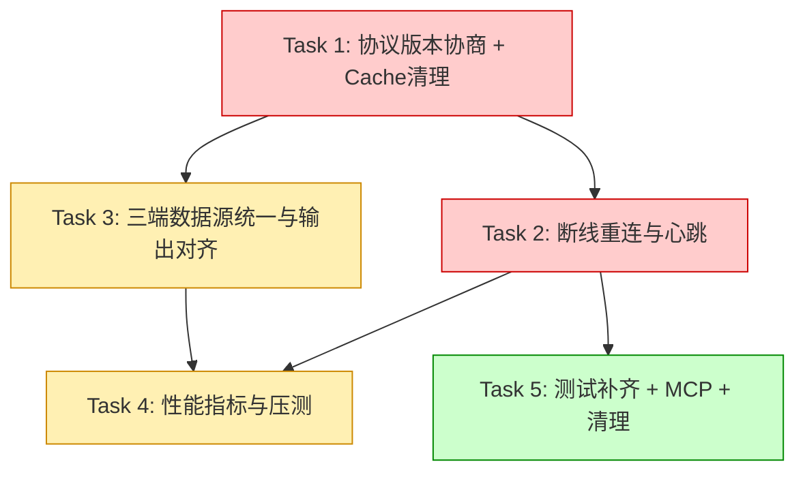

# 开发任务

## 概览

- **Feature**: code-quality-plan 执行阶段（iota-sympantos 代码质量变更实施）
- **任务数**: 5
- **项目大类**: existing（Rust workspace + Tauri/React desktop，代码变更型）
- **API 策略**: 内部协议扩展（Daemon proto、ObservabilitySummary），不对外暴露新 API
- **交付物根目录**: `crates/`（源码变更）+ `.kiro/specs/code-quality-plan/`（产出基线文档）
- **关键约束**:
  - 向后兼容：`DESKTOP_PROTOCOL_VERSION = 2` 客户端连新 server 仍正常
  - 增量可交付：每个 FR 独立 commit，任意中断后已完成代码可编译
  - 性能无退化：心跳/指标不阻塞主业务路径
  - 测试约定：独立 `*_tests.rs`，禁止内联 `mod tests`

## 需求覆盖矩阵

| 验收标准 | 内容摘要 | 对应任务 | 覆盖状态 |
|----------|---------|---------|---------|
| FR-001 AC1.1 | Hello 握手阶段完成版本协商（min/max range） | Task 1 | ✅ |
| FR-001 AC1.2 | version 不兼容返回结构化错误并断开 | Task 1 | ✅ |
| FR-001 AC1.3 | 连接上下文记录协商结果 | Task 1 | ✅ |
| FR-001 AC1.4 | v2 客户端向后兼容 | Task 1 | ✅ |
| FR-001 AC1.5 | tagged enum + exhaustive match | Task 1 | ✅ |
| FR-002 AC2.1 | 指数退避自动重连（1s→30s, jitter ±20%） | Task 2 | ✅ |
| FR-002 AC2.2 | 空闲 30s 发送 Ping 心跳 | Task 2 | ✅ |
| FR-002 AC2.3 | 连续 3 次心跳无响应断开重连 | Task 2 | ✅ |
| FR-002 AC2.4 | 重连成功 emit 前端事件通知 UI | Task 2 | ✅ |
| FR-002 AC2.5 | 重连期间操作排队不丢弃 | Task 2 | ✅ |
| FR-002 AC2.6 | 保留 600s 操作超时独立于心跳超时 | Task 2 | ✅ |
| FR-003 AC3.1 | CLI tokens 命令通过 daemon GetObservabilitySummary | Task 3 | ✅ |
| FR-003 AC3.2 | TUI 消费同一 ObservabilitySummary 结构体 | Task 3 | ✅ |
| FR-003 AC3.3 | Desktop RightInspector 使用相同字段名和单位 | Task 3 | ✅ |
| FR-003 AC3.4 | CLI 离线 fallback 直读 store 显式标注 | Task 3 | ✅ |
| FR-003 AC3.5 | 删除/废弃 CLI 直读 ObservabilityStore 旧路径 | Task 3 | ✅ |
| FR-004 AC4.1 | 删除 cache.rs:228 调用 + :281-303 函数体 | Task 1 | ✅ |
| FR-004 AC4.2 | 删除 cache_tests.rs 迁移测试用例 | Task 1 | ✅ |
| FR-004 AC4.3 | cargo test -p iota-core 全部通过 | Task 1 | ✅ |
| FR-004 AC4.4 | 其他引用 migrate_legacy 一并清理 | Task 1 | ✅ |
| FR-005 AC5.1 | token usage 写入记录延迟 histogram | Task 4 | ✅ |
| FR-005 AC5.2 | 流式推送记录吞吐 tokens/s | Task 4 | ✅ |
| FR-005 AC5.3 | ObservabilitySummary 包含延迟和吞吐字段 | Task 4 | ✅ |
| FR-005 AC5.4 | 如指标注册接口不存在则先扩展 | Task 4 | ✅ |
| FR-006 AC6.1 | 压测测量 JSON-line 吞吐 msgs/s | Task 4 | ✅ |
| FR-006 AC6.2 | 压测测量首 token 延迟 p50/p99 ms | Task 4 | ✅ |
| FR-006 AC6.3 | 输出可复现 bench 脚本或 #[bench] 测试 | Task 4 | ✅ |
| FR-006 AC6.4 | 低于 100 msgs/s 标记性能瓶颈 | Task 4 | ✅ |
| FR-007 AC7.1 | 三端 token count 使用相同字段名 | Task 3 | ✅ |
| FR-007 AC7.2 | 三端 cost 使用 USD + 4 位小数 | Task 3 | ✅ |
| FR-007 AC7.3 | 三端 duration 使用 ms + round half up | Task 3 | ✅ |
| FR-007 AC7.4 | 新增字段三端同步更新渲染 | Task 3 | ✅ |
| FR-008 AC8.1 | 列出缺少 *_tests.rs 的源模块 | Task 5 | ✅ |
| FR-008 AC8.2 | 核心公开函数至少 1 个正向测试 | Task 5 | ✅ |
| FR-008 AC8.3 | 遵循 ut-standardization 约定 | Task 5 | ✅ |
| FR-008 AC8.4 | 依赖外部的用 mock/ignore | Task 5 | ✅ |
| FR-009 AC9.1 | 集成测试覆盖 Hello→StartTurn→响应流 | Task 5 | ✅ |
| FR-009 AC9.2 | 测试自动重连恢复 | Task 5 | ✅ |
| FR-009 AC9.3 | 集成测试覆盖 Kanban dispatcher→event_sync | Task 5 | ✅ |
| FR-009 AC9.4 | 无法自动化的编写手工 runbook | Task 5 | ✅ |
| FR-010 AC10.1 | 提取 Rust MCP 协议字段清单 | Task 5 | ✅ |
| FR-010 AC10.2 | 输出漂移表 | Task 5 | ✅ |
| FR-010 AC10.3 | 影响正确性标 P1 修复项 | Task 5 | ✅ |
| FR-010 AC10.4 | 仓库不可访问仅输出 Rust 基线 | Task 5 | ✅ |
| FR-011 AC11.1 | 检查迁移函数是否幂等 | Task 1 | ✅ |
| FR-011 AC11.2 | 确认临时表仅迁移路径触发 | Task 1 | ✅ |
| FR-011 AC11.3 | 幂等无依赖则标记可安全移除 | Task 1 | ✅ |
| FR-011 AC11.4 | 有 v0 残留则保留并标注等待 | Task 1 | ✅ |
| FR-012 AC12.1 | approvals.rs:286 注释改为准确描述 | Task 5 | ✅ |
| FR-012 AC12.2 | 运行 cargo clippy + tsc --noEmit | Task 5 | ✅ |
| FR-012 AC12.3 | 修复所有 warning | Task 5 | ✅ |
| FR-012 AC12.4 | 环境不支持则人工审查 | Task 5 | ✅ |
| NFR-001 AC1.1 | 每个 FR 后 cargo build 无 error | 全部 | ✅ |
| NFR-001 AC1.2 | 每个 FR 后 cargo test 无新 failure | 全部 | ✅ |
| NFR-001 AC1.3 | TypeScript 变更后 tsc --noEmit 无 error | Task 2, 3 | ✅ |
| NFR-002 AC2.1 | 每个 FR 独立 commit 含 FR-ID | 全部 | ✅ |
| NFR-002 AC2.2 | 依赖关系严格按顺序 | 全部 | ✅ |
| NFR-002 AC2.3 | 中断后已完成 FR 可独立编译 | 全部 | ✅ |
| NFR-003 AC3.1 | 心跳不增加正常通信延迟 | Task 2 | ✅ |
| NFR-003 AC3.2 | 指标记录不阻塞主业务路径 | Task 4 | ✅ |

**覆盖率**: 57 / 57 = 100% ✅

## 任务列表

### Task 1: 协议版本协商 + Cache Legacy 清理 ✅

**关联需求**: FR-001 (AC1.1~1.5), FR-011 (AC11.1~11.4), FR-004 (AC4.1~4.4)
**目标**: 实现 Daemon 协议版本协商机制（v2 向后兼容），复核并移除 cache.rs legacy 迁移代码。
**依赖**: 无
**实施**:
1. **FR-011 Cache 复核**（设计 §3.11）：
   - 读取 `cache.rs:281-309` 确认迁移函数幂等、临时表仅迁移触发、无外部引用
   - 得出可安全移除结论
2. **FR-001 协议版本协商**（设计 §3.1）：
   - `proto.rs`: 新增 `PROTOCOL_VERSION_MIN=2`/`MAX=3` 常量
   - 扩展 `DaemonClientMessage::Hello` 添加 `min_version`/`max_version` 字段（`serde(default)`）
   - 扩展 `DaemonServerMessage::HelloAccepted` 添加 `negotiated_version`
   - `desktop.rs`: 实现 `negotiate_version()` 函数 + `DesktopConnectionContext`
   - `daemon_client.rs`: `hello_message()` 发送 min/max version
   - `proto_tests.rs`: 新增协商成功/失败/v2兼容测试用例
3. **FR-004 Cache Legacy 移除**（设计 §3.4）：
   - 删除 `cache.rs:228` 调用行
   - 删除 `cache.rs:281-309` 函数体 + `has_full_backend_request_hash_unique_index` 辅助函数
   - 删除 `cache_tests.rs` 中 `migrated_legacy_database_*` 测试
   - grep 确认无其他引用
4. 验证编译：`cargo build --workspace && cargo test -p iota-core`
5. 按 FR 分别 commit（FR-011、FR-001、FR-004 各一个 commit）

**文件**:
- `crates/iota-core/src/daemon/proto.rs` — 新增常量 + 扩展消息字段
- `crates/iota-core/src/daemon/desktop.rs` — 新增协商逻辑
- `crates/iota-core/src/daemon/proto_tests.rs` — 新增测试
- `crates/iota-desktop/src-tauri/src/daemon_client.rs` — hello 扩展
- `crates/iota-core/src/store/cache.rs` — 删除迁移代码
- `crates/iota-core/src/store/cache_tests.rs` — 删除迁移测试

**验证**:
- `cargo build --workspace` 无 error
- `cargo test -p iota-core` 全部通过
- v2 兼容测试：不带 min/max 的 Hello 消息反序列化成功、协商结果为 2

---

### Task 2: Desktop Daemon 断线重连与心跳 ✅

**关联需求**: FR-002 (AC2.1~2.6), NFR-001 (AC1.3), NFR-003 (AC3.1)
**目标**: 实现 daemon_client 持久连接、指数退避重连、Ping/Pong 心跳、操作排队机制。
**依赖**: Task 1（版本协商完成后 Ping/Pong 仅 v3+ 启用）
**实施**:
1. **协议扩展**（设计 §3.2.1）：
   - `proto.rs`: 新增 `Ping { seq: u64 }` / `Pong { seq: u64 }` 变体
   - `desktop.rs`: 处理 Ping → 回复 Pong
2. **持久连接重构**（设计 §3.2.2~3.2.3）：
   - `daemon_client.rs`: 新增 `ReconnectConfig`、`ConnectionState`、`DaemonConnection`
   - 实现 `reconnect()`: 指数退避（1s→30s）+ jitter ±20%
   - 将 `start_turn` / `send_one` 从每次新建连接改为复用持久连接
3. **心跳逻辑**（设计 §3.2.4）：
   - `heartbeat_loop`: 30s 间隔发 Ping，连续 3 次无 Pong 断开触发重连
   - 心跳独立于 600s 操作超时
4. **操作排队**（设计 §3.2.5）：
   - 重连期间调用放入 pending queue，重连成功后自动重发
5. **前端事件**（设计 §3.2.6）：
   - `types.ts`: 新增 `DaemonConnectionState` 类型
   - `daemon_client.rs`: emit `"daemon-connection-state"` 事件
6. 验证：`cargo build --workspace && cargo test --workspace && cd crates/iota-desktop && npx tsc --noEmit`
7. 独立 commit（FR-002）

**文件**:
- `crates/iota-core/src/daemon/proto.rs` — Ping/Pong 变体
- `crates/iota-core/src/daemon/desktop.rs` — 处理 Ping
- `crates/iota-desktop/src-tauri/src/daemon_client.rs` — 持久连接 + 重连 + 心跳 + 排队
- `crates/iota-desktop/src/types.ts` — ConnectionState 类型

**验证**:
- Ping/Pong 仅 `negotiated_version >= 3` 启用（NFR-003 AC3.1：不影响正常通信）
- `cargo test --workspace` 通过
- TypeScript `tsc --noEmit` 无 error
- 重连测试：模拟 EOF → 验证退避延迟范围（1s±20% ~ 30s）

---

### Task 3: 三端数据源统一与输出对齐 ✅

**关联需求**: FR-003 (AC3.1~3.5), FR-007 (AC7.1~7.4), NFR-001 (AC1.3)
**目标**: CLI/TUI/Desktop 统一使用强类型 daemon ObservabilitySummary 响应，三端字段名、单位、精度完全一致。
**依赖**: Task 1（版本协商使新字段可在连接上下文判定可用性）
**实施**:
1. **强类型替换 serde_json::Value**（设计 §3.3.1~3.3.2）：
   - `proto.rs`: 新增 `ObservabilitySummaryResponse`、`TokenSummaryEntry`、`RecentTokenExecution` 结构体
   - 替换 `ObservabilitySummary { summary: serde_json::Value }` 为强类型
   - `desktop.rs`: 使用强类型构建响应
2. **CLI 双路径**（设计 §3.3.3）：
   - `observability_cmd.rs`: 新增 daemon 优先路径 + offline fallback（显式标注）
   - 废弃直读 store 旧路径（标注 `/// Offline fallback`）
3. **字段对齐**（设计 §3.7）：
   - 统一规范：`normalized_total_tokens`(整数)、`input_tokens`(整数)、`output_tokens`(整数)、`cost_usd`(USD/4位小数)、`duration_ms`(ms/round half up)
   - `observability_cmd.rs`: print 函数使用一致字段名
   - `status_bar.rs`: 确认渲染字段与 TokenSummaryEntry 语义一致
   - `RightInspector.tsx`: 确认字段对齐
4. 验证：`cargo build --workspace && cargo test --workspace && cd crates/iota-desktop && npx tsc --noEmit`
5. 分别 commit（FR-003、FR-007）

**文件**:
- `crates/iota-core/src/daemon/proto.rs` — 强类型结构体
- `crates/iota-core/src/daemon/desktop.rs` — 构建强类型响应
- `crates/iota-cli/src/cli/observability_cmd.rs` — daemon路径 + fallback + 字段对齐
- `crates/iota-cli/src/tui/status_bar.rs` — 字段确认/对齐
- `crates/iota-desktop/src/components/RightInspector.tsx` — 字段确认/对齐
- `crates/iota-desktop/src/types.ts` — 类型更新

**验证**:
- CLI `tokens` 命令优先通过 daemon 路径获取数据
- daemon 未运行时 fallback 正常工作
- 三端输出的 token/cost/duration 字段名和精度一致
- `cargo test --workspace` + `tsc --noEmit` 通过

---

### Task 4: 性能指标暴露与压测基准 ✅

**关联需求**: FR-005 (AC5.1~5.4), FR-006 (AC6.1~6.4), NFR-003 (AC3.2)
**目标**: 实现 token usage 延迟/吞吐指标记录并暴露到 ObservabilitySummary，建立 daemon JSON-line 吞吐压测基准。
**依赖**: Task 2（FR-006 压测依赖重连/心跳完成）, Task 3（ObservabilitySummaryResponse 结构体已就绪）
**实施**:
1. **Metrics 注册接口**（设计 §3.5.1）：
   - `observability.rs`: 新增 `ObservabilityMetrics`（`Arc<Mutex<Vec<f64>>>`）
   - 实现 `record_write_latency()`、`record_stream_throughput()`
   - 实现 `write_latency_percentiles()` → `LatencyPercentiles { p50_ms, p99_ms, count }`
   - 实现 `stream_throughput_summary()` → `ThroughputSummary { mean_tokens_per_sec, count }`
2. **写入延迟记录**（设计 §3.5.2）：
   - `record_token_usage_with_metrics()` 包装：`Instant::now()` → 记录 → 计算 elapsed
   - 异步/fire-and-forget 模式不阻塞主路径（NFR-003 AC3.2）
3. **Summary 响应扩展**（设计 §3.5.3）：
   - `ObservabilitySummaryResponse` 新增 `write_latency`、`stream_throughput` 字段
   - `desktop.rs` 构建响应时包含 metrics
4. **Bench 文件**（设计 §3.6）：
   - 新增 `crates/iota-core/benches/daemon_throughput.rs`
   - criterion bench: `bench_jsonline_throughput`（序列化 msgs/s）+ `bench_first_token_latency`
   - `Cargo.toml`: 添加 criterion dev-dependency + `[[bench]]` target
   - 阈值：≥ 100 msgs/s，否则标记性能瓶颈
5. 验证：`cargo build --workspace && cargo test -p iota-core && cargo bench -p iota-core`
6. 分别 commit（FR-005、FR-006）

**文件**:
- `crates/iota-core/src/store/observability.rs` — Metrics 结构 + 延迟记录
- `crates/iota-core/src/store/observability_tests.rs` — 指标测试
- `crates/iota-core/src/daemon/proto.rs` — Summary 字段扩展
- `crates/iota-core/src/daemon/desktop.rs` — 响应包含 metrics
- `crates/iota-core/benches/daemon_throughput.rs` — 新增 bench
- `crates/iota-core/Cargo.toml` — criterion 依赖 + bench target

**验证**:
- `ObservabilitySummary` 响应含 `write_latency`/`stream_throughput` 非 null
- `cargo bench -p iota-core` 可执行，输出 msgs/s 数据
- 指标记录不阻塞 `record_token_usage` 正常返回（异步测量）

---

### Task 5: 测试补齐 + MCP 基线 + 代码清理 ✅

**关联需求**: FR-008 (AC8.1~8.4), FR-009 (AC9.1~9.4), FR-010 (AC10.1~10.4), FR-012 (AC12.1~12.4)
**目标**: 补齐单元测试缺口和集成测试，建立 MCP 协议基线，清理注释与 lint 告警。
**依赖**: Task 2（集成测试 AC9.2 需重连机制已实现）
**实施**:
1. **FR-008 单元测试补齐**（设计 §3.8）：
   - 扫描 `crates/iota-core/src/` 缺少 `*_tests.rs` 的模块
   - 优先补齐：`mcp/client_tests.rs`（P1）、`engine/session_ledger_tests.rs`（P2）
   - 每个公开函数至少 1 个正向测试；依赖外部的用 mock trait 或 `#[ignore]`
   - `client.rs` 添加 `#[cfg(test)] #[path = "client_tests.rs"] mod tests;`
2. **FR-009 集成测试**（设计 §3.9）：
   - 新增 `crates/iota-core/tests/daemon_integration.rs`
   - 场景：Hello→StartTurn→TextChunk 完整链路（AC9.1）
   - 场景：断开→自动重连恢复（AC9.2）
   - 场景：Kanban dispatcher→event_sync（AC9.3，如可行）
   - 无法自动化场景编写手工 runbook（AC9.4）
3. **FR-010 MCP 漂移检测**（设计 §3.10）：
   - 从 `mcp/client.rs`、`server.rs`、`router.rs`、`tool_dispatch.rs` 提取协议字段清单
   - 输出 `.kiro/specs/code-quality-plan/mcp-baseline.md`
   - 检查 `/platform/.ref-clones/` 下是否有 iota-fun，有则对比输出漂移表
4. **FR-012 代码清理**（设计 §3.12）：
   - `approvals.rs:286`: 注释从 `Fallback legacy blacklists` 改为 `Defense-in-depth: path traversal check`
   - `cargo clippy --workspace -- -D warnings`：修复所有 warning
   - `cd crates/iota-desktop && npx tsc --noEmit`：修复 type error
5. 分别 commit（FR-008、FR-009、FR-010、FR-012）

**文件**:
- `crates/iota-core/src/mcp/client_tests.rs` — 新增
- `crates/iota-core/src/mcp/client.rs` — 添加 test module 声明
- `crates/iota-core/src/engine/session_ledger_tests.rs` — 新增
- `crates/iota-core/tests/daemon_integration.rs` — 新增集成测试
- `crates/iota-core/src/store/approvals.rs` — 注释修改
- `.kiro/specs/code-quality-plan/mcp-baseline.md` — 新增 MCP 基线文档
- 全 workspace — clippy/tsc 修复

**验证**:
- `cargo test --workspace` 通过（含新增单元测试和集成测试）
- `cargo clippy --workspace -- -D warnings` 无 warning
- `mcp-baseline.md` 包含消息类型 + 字段 + 类型清单
- 手工 runbook 对无法自动化场景有说明

## 进度

| 任务 | 关联需求 | 状态 |
|------|----------|------|
| Task 1: 协议版本协商 + Cache Legacy 清理 | FR-001, FR-011, FR-004 | ✅ |
| Task 2: 断线重连与心跳 | FR-002 | ✅ |
| Task 3: 三端数据源统一与输出对齐 | FR-003, FR-007 | ✅ |
| Task 4: 性能指标暴露与压测基准 | FR-005, FR-006 | ✅ |
| Task 5: 测试补齐 + MCP 基线 + 代码清理 | FR-008, FR-009, FR-010, FR-012 | ✅ |

## 执行顺序与依赖图

**关键路径**: Task 1 → Task 2 → Task 4（协议基础 → 重连/心跳 → 性能指标/压测）

## Commit 规划（NFR-002 增量可交付）

| 顺序 | FR-ID | Commit Message 模板 | 所属任务 |
|------|-------|---------------------|---------|
| 1 | FR-011 | `feat(store): verify cache legacy migration safe for removal [FR-011]` | Task 1 |
| 2 | FR-001 | `feat(daemon): implement protocol version negotiation [FR-001]` | Task 1 |
| 3 | FR-004 | `refactor(store): remove cache legacy migration code [FR-004]` | Task 1 |
| 4 | FR-002 | `feat(desktop): add daemon reconnect and heartbeat [FR-002]` | Task 2 |
| 5 | FR-003 | `refactor(cli): unify token data source via daemon [FR-003]` | Task 3 |
| 6 | FR-007 | `fix(cli,desktop): align observability field names and units [FR-007]` | Task 3 |
| 7 | FR-005 | `feat(store): expose token usage latency/throughput metrics [FR-005]` | Task 4 |
| 8 | FR-006 | `perf(daemon): add JSON-line throughput benchmark [FR-006]` | Task 4 |
| 9 | FR-008 | `test(core): add unit tests for mcp/client and engine [FR-008]` | Task 5 |
| 10 | FR-009 | `test(core): add daemon integration tests [FR-009]` | Task 5 |
| 11 | FR-010 | `docs(mcp): establish cross-language protocol baseline [FR-010]` | Task 5 |
| 12 | FR-012 | `fix(store,desktop): clean up naming and lint warnings [FR-012]` | Task 5 |

## 总工作量估算

| 任务 | 估算（人日） |
|------|------------|
| Task 1 | 1.5（协议协商 1.0 + Cache 清理 0.5） |
| Task 2 | 2.0（持久连接重构 + 心跳 + 排队 + 前端事件） |
| Task 3 | 1.5（强类型替换 + CLI双路径 + 三端对齐） |
| Task 4 | 1.5（Metrics接口 + 延迟记录 + bench） |
| Task 5 | 2.5（单元测试 0.5 + 集成测试 1.0 + MCP基线 0.5 + clippy/tsc 0.5） |
| **合计** | **9.0 人日** |

> 所有任务均 ≤ 5 人日，无需拆分。按 NFR-002 增量交付，任何中断后已完成的 FR 代码可独立编译运行。

---

skills_used: code-review, openspec-apply-change
