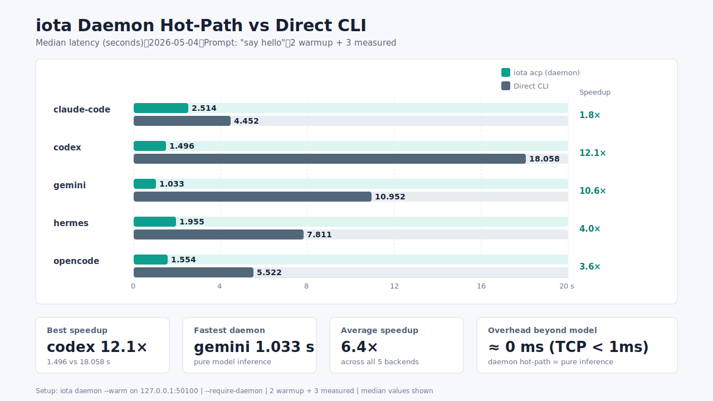

# ACP Runtime: Process Model & Benchmarks

## 1 Execution Paths

| Path | Command | Behavior |
|---|---|---|
| CLI | `iota acp <backend> <prompt>` | 优先连 daemon；不可用时回退到进程内 `IotaEngine` |
| TUI | `iota tui` | 首次选择 backend 时 lazy-start，退出前复用 |
| Daemon | `iota daemon [--warm]` | 常驻 `IotaEngine`，跨 CLI 调用复用 subprocess 和 session |

### 1.1 Client Caching

缓存 key = `(backend, cwd)`。同 key 复用同一 `AcpClient` 及其 `sessionId`。cwd 变更产生新 key。

### 1.2 ACP Protocol Lifecycle

```
process spawn → initialize → session/new → session/prompt → session/update* → session/complete
```

- **Warm**: 执行到 `initialize`，不发 prompt。
- **Cold session**: 首次 prompt 需 `session/new`。
- **Hot session**: 复用 `sessionId`，跳过 spawn/init/session_new。

## 2 Daemon & Warm Control Plane

监听 `127.0.0.1:47661`（`IOTA_DAEMON_ADDR` 可覆盖），TCP JSON 协议：

| Type | Fields | Response |
|---|---|---|
| Prompt | `backend`, `cwd`, `prompt`, `timeout_ms`, `trace_timing` | `ok`, `text`, `timing` |
| Warm | `request_type: "warm"`, `cwd`, `backends` | `ok`, `warmed` |

```powershell
$env:IOTA_DAEMON_ADDR = '127.0.0.1:50100'
target\debug\iota.exe daemon --warm
target\debug\iota.exe warm codex claude-code
target\debug\iota.exe acp --require-daemon --trace-timing claude-code --timeout-ms 30000 "say hello"
```

## 3 Timing Instrumentation

`--trace-timing` 输出 JSON 到 stderr：

```json
{"route":"daemon","daemon_hit":true,"fallback":false,"backend":"claude-code",
 "timing":{"client_started":false,"process_spawned":false,"session_reused":true,"prompt_ms":6083,"total_ms":6083}}
```

### 3.1 Fields

| Field | Type | Meaning |
|---|---|---|
| `client_started` | bool | 本次是否新启动 AcpClient |
| `process_spawned` | bool | 本次是否 spawn 后端进程 |
| `process_spawn_ms` | u64? | spawn 耗时（仅 client_started=true） |
| `init_ms` | u64? | ACP initialize 耗时 |
| `session_reused` | bool | 是否复用 sessionId |
| `session_new_ms` | u64? | session/new 耗时 |
| `prompt_ms` | u64 | prompt → complete 耗时 |
| `total_ms` | u64 | 总耗时 |

### 3.2 CLI Flags

| Flag | Purpose |
|---|---|
| `--require-daemon` | daemon 不可用时报错，不回退 |
| `--trace-timing` | 输出 timing JSON 到 stderr |
| `--show-native` | 打印原始 JSON-RPC 消息 |

## 4 Backend Processes

| Backend | ACP Adapter |
|---|---|
| Claude Code | `npx -y @agentclientprotocol/claude-agent-acp@latest` |
| Codex | `npx -y @zed-industries/codex-acp@latest` |
| Gemini | `npx -y @google/gemini-cli@latest --acp` |
| Hermes | `hermes acp` |
| OpenCode | `npx -y opencode-ai@latest acp` |

Windows 上 `npx` normalize 为 `npx.cmd`。设计单位是 ACP client/channel，非 OS 进程。

## 5 Benchmark Commands

| Command | Measures |
|---|---|
| `iota bench-cold <rounds>` | 冷启动（独立 spawn + prompt + shutdown） |
| `iota bench-warm <rounds>` | 进程内热路径（预热后重复 prompt） |
| `iota daemon --warm` + `iota acp --require-daemon` | 跨 CLI 热路径（daemon 复用） |
| `iota warm [backend ...]` | 只预热，不发 prompt |

## 6 Measured Results (2026-05-04)

Setup: `iota daemon --warm` on `127.0.0.1:50100`，5 backend 预热。2 warmup + 3 measured。Prompt: `say hello. reply with exactly: hello`。

### 6.1 Summary

| Backend | Daemon (ms) | Direct CLI (ms) | Speedup |
|---|---:|---:|---|
| claude-code | **2514** | 4452 | **1.8×** |
| codex | **1496** | 18058 | **12.1×** |
| gemini | **1033** | 10952 | **10.6×** |
| hermes | **1955** | 7811 | **4.0×** |
| opencode | **1554** | 5522 | **3.6×** |



### 6.2 Raw Data

#### claude-code

| Path | R1 | R2 | R3 | Median |
|---|---:|---:|---:|---:|
| daemon | 2514 | 2381 | 3790 | **2514** |
| `claude --print` | 4424 | 4653 | 4452 | **4452** |

#### codex

| Path | R1 | R2 | R3 | Median |
|---|---:|---:|---:|---:|
| daemon | 1496 | 1481 | 1531 | **1496** |
| `codex exec` | 17683 | 18194 | 18058 | **18058** |

#### gemini

| Path | R1 | R2 | R3 | Median |
|---|---:|---:|---:|---:|
| daemon | 1342 | 950 | 1033 | **1033** |
| `gemini --prompt` | 10759 | 11285 | 10952 | **10952** |

#### hermes

| Path | R1 | R2 | R3 | Median |
|---|---:|---:|---:|---:|
| daemon | 7487¹ | 1341 | 1955 | **1955** |
| `hermes --oneshot` | 8761 | 7570 | 7811 | **7811** |

¹ R1 含首次 `session/new`；R2-R3 复用 session。

#### opencode

| Path | R1 | R2 | R3 | Median |
|---|---:|---:|---:|---:|
| daemon | 1554 | 1322 | 1941 | **1554** |
| `opencode run` | 6386 | 5522 | 5314 | **5522** |

### 6.3 Overhead Analysis

| Phase | Daemon hot | Direct CLI |
|---|---|---|
| Process spawn | — | 3-12s |
| ACP initialize | — | 1-3s |
| Session creation | — | ~1s |
| Model inference | ✓ | ✓ |
| **Overhead beyond model** | **< 1ms** | **3-17s** |

### 6.4 Improvement vs Historical

| Backend | Before (no --require-daemon) | After (daemon hot) | Δ |
|---|---:|---:|---|
| claude-code | 9082 | 2514 | **-72%** |
| codex | 12701 | 1496 | **-88%** |
| gemini | 16943 | 1033 | **-94%** |
| hermes | 9837 | 1955 | **-80%** |
| opencode | 10176 | 1554 | **-85%** |

Daemon 热路径延迟 ≈ 纯模型推理。Direct CLI 每次付 spawn + init + session 成本（3-17s）。
